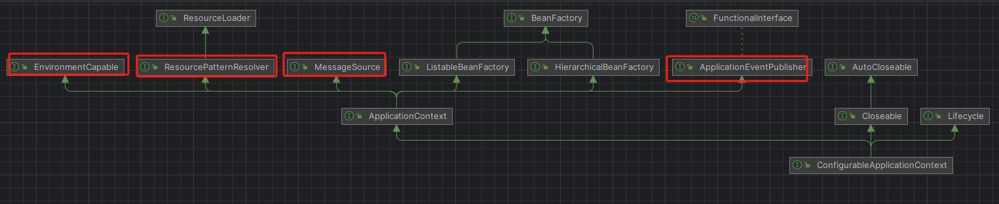
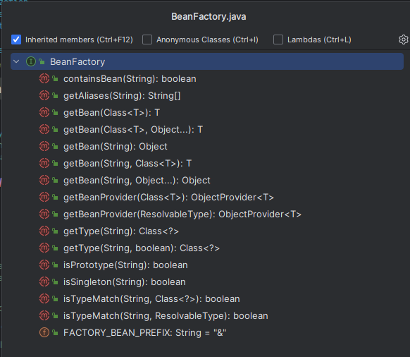

## BeanFactory和ApplicationContext的关系

SpringBoot启动类返回的是一个ConfigurableApplicationContext类，这个类继承ApplicationContext
ConfigurableApplicationContext继承图,说明多一些其他能力

BeanFactory能干嘛

ApplicationContext主要是多了四个接口功能
国际化，获取资源，获取环境变量，监听接口